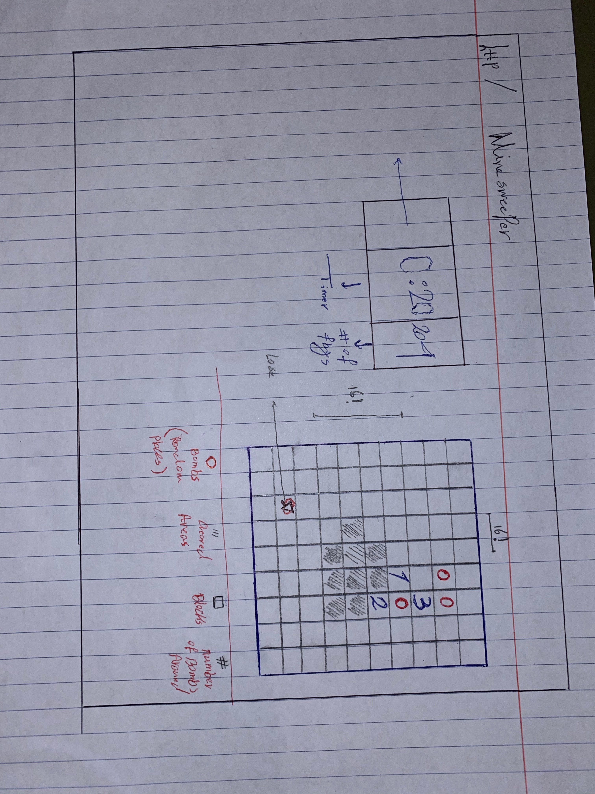

# Minesweeper

## **Game** Play :
* **user will be able to choose the size of the grid from three available options.**
* **user will _be_ able to determine the difficulty of the game by choosing the number of bombs**
  
* **Mines(aliens) will be placed in random locations**
  
* **if player clicks on a cell that does not contain a bomb, the number of the bombs in eight direction of that cell will be displayed.**
* **if there are no bombs around it will check the same process for other eight cells**
* **if the user clicks on a cell that contains a bomb the game is over**
* **if all the cells are cleared and cells with bomb are untouched user wins.**
 # Image of **the** menu

# Image of the grid

# win 

# lose
;

# **Technologies** Used
 

# 
# 
# 
# 
# 
# **lets** play
# https://labeast021.github.io/Minesweeper/

<!-- ## wire frames  :

 -->

